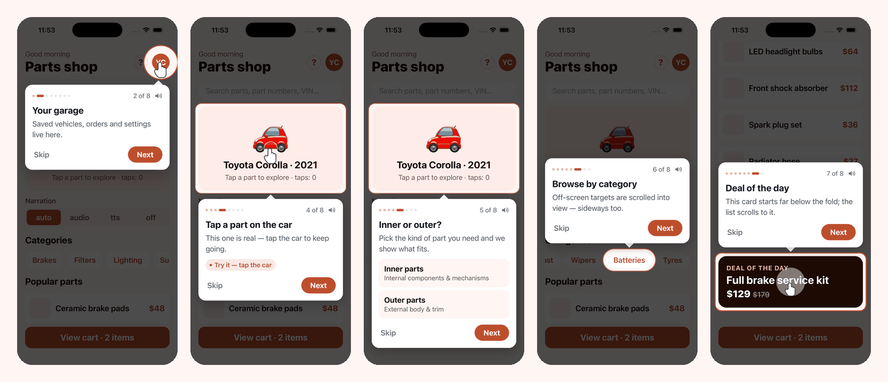

# react-native-spotlight-walkthrough

[](https://github.com/uniqueyash18/react-native-spotlight-walkthrough/actions/workflows/ci.yml)
[](https://www.npmjs.com/package/react-native-spotlight-walkthrough)
[](LICENSE)

<a href="https://drive.google.com/file/d/1Xg0AcA29E3qsmsc1y3e0_k8JFU5aZnvq/view?usp=sharing"></a>

**[▶ Watch the demo video](https://drive.google.com/file/d/1Xg0AcA29E3qsmsc1y3e0_k8JFU5aZnvq/view?usp=sharing)**

Interactive spotlight walkthroughs for React Native.

- **Interactive steps.** The spotlight hole can pass touches through, so users try the real gesture instead of only reading about it. Your code moves the tour forward when they do.
- **Gesture simulations.** An animated hand demonstrates tap, double tap, long press, swipe or pinch on the target. You can also build your own from the same primitives.
- **Narration: audio files or TTS.** Each step can play a voice-over file, or have its text read out by text-to-speech. In the default `auto` mode, TTS takes over when a step has no file or the file fails. Adapters for `expo-audio` and `expo-speech` are included, and the tooltip has a mute toggle.
- **Show once.** A tour can remember it has been seen, using any storage (AsyncStorage, MMKV, expo-secure-store and so on).
- **Fully themeable.** You can change the overlay colour and opacity, the hole shape (`rect`, `pill`, `circle`, `none`), padding, radius, ring, pulse and morph timing. The tooltip, text, buttons, progress dots, arrow, hand and ripple are all themeable. You can override the theme per step, or replace the tooltip or hand completely.
- **Built with** Reanimated and react-native-svg. It works in RTL layouts and respects safe areas.

## Install

```sh
npm install react-native-spotlight-walkthrough
# peer dependencies (most apps already have them)
npm install react-native-reanimated react-native-svg react-native-safe-area-context
# optional, for narration
npx expo install expo-audio expo-speech
```

## Expo or bare React Native

The core needs only `react-native-reanimated`, `react-native-svg` and `react-native-safe-area-context`, so it works with or without Expo. Only the two optional narration adapters (`/expo-audio`, `/expo-speech`) are Expo modules.

| | Expo (dev build) | Expo Go | Bare React Native |
| --- | --- | --- | --- |
| Spotlight, tooltips, simulations, scrolling, show-once | ✅ | ✅ | ✅ |
| Narration through the bundled Expo adapters | ✅ | ✅ | With `npx install-expo-modules`, or use your own adapters (below) |

Tested on iOS with an Expo SDK 57 development build (React Native 0.86) and with bare React Native 0.87.

### Bare React Native setup

```sh
npm install react-native-spotlight-walkthrough \
  react-native-reanimated react-native-worklets react-native-svg react-native-safe-area-context
cd ios && pod install
```

Add the worklets Babel plugin. It must be the last plugin in the list:

```js
// babel.config.js
module.exports = {
  presets: ['module:@react-native/babel-preset'],
  plugins: ['react-native-worklets/plugin'], // Reanimated 3: 'react-native-reanimated/plugin'
};
```

**Xcode 27.** Xcode 27 rejects any pod that targets an iOS version below 15. `react-native-svg`'s filters target still declares 12.4, so the build fails with *"IPHONEOS_DEPLOYMENT_TARGET is set to 12.4"*. Raise every pod in the Podfile's `post_install`, then run `pod install` again. Expo apps already do this.

```ruby
post_install do |installer|
  react_native_post_install(installer, config[:reactNativePath], :mac_catalyst_enabled => false)

  installer.pods_project.targets.each do |target|
    target.build_configurations.each do |build_config|
      if build_config.build_settings['IPHONEOS_DEPLOYMENT_TARGET'].to_f < 15.1
        build_config.build_settings['IPHONEOS_DEPLOYMENT_TARGET'] = '15.1'
      end
    end
  end
end
```

### Narration without Expo

Plug any player and TTS engine into the two adapter interfaces. These were tested with `react-native-sound` and `react-native-tts`:

```tsx
import Sound from 'react-native-sound';
import Tts from 'react-native-tts';
import type { WalkthroughAudioAdapter, WalkthroughSpeechAdapter } from 'react-native-spotlight-walkthrough';

Sound.setCategory('Playback');
let current: Sound | null = null;

export const audio: WalkthroughAudioAdapter = {
  // Resolve once playback starts; reject if it can't load, so 'auto' falls back to TTS.
  play: (source) =>
    new Promise<void>((resolve, reject) => {
      current?.stop();
      current?.release();
      const onLoad = (error: unknown) => {
        if (error) return reject(error);
        sound.play();
        resolve();
      };
      const sound =
        typeof source === 'string' ? new Sound(source, '', onLoad) : new Sound(source as number, onLoad);
      current = sound;
    }),
  stop: () => current?.stop(),
};

export const speech: WalkthroughSpeechAdapter = {
  speak: (text, { language } = {}) => {
    Tts.stop();
    if (language) Tts.setDefaultLanguage(language).catch(() => {});
    Tts.speak(text);
  },
  stop: () => Tts.stop(),
};

<WalkthroughProvider audio={audio} speech={speech} speechLanguage="en-US">
```

`react-native-sound` plays files packaged inside the app. On iOS it can't play from a URL, and that includes `require()`d assets in a **debug** build, because those are served from Metro over HTTP. In `auto` mode those steps fall back to TTS, which is fine. For remote voice-overs, use `react-native-track-player` or `react-native-video` in the audio adapter instead.

## Quick start

Wrap your app once, inside `SafeAreaProvider`:

```tsx
import { WalkthroughProvider } from 'react-native-spotlight-walkthrough';

export default function App() {
  return (
    <SafeAreaProvider>
      <WalkthroughProvider theme={{ accentColor: '#BC4E2C' }}>
        <Navigation />
      </WalkthroughProvider>
    </SafeAreaProvider>
  );
}
```

Mark what you want to spotlight, then start a tour:

```tsx
import {
  WalkthroughTarget,
  useWalkthrough,
  type WalkthroughTour,
} from 'react-native-spotlight-walkthrough';

const homeTour: WalkthroughTour = {
  id: 'home-v1',
  showOnce: true,
  steps: [
    {
      id: 'search',
      target: 'search-bar',
      title: 'Search anything',
      message: 'Find parts by name, number or VIN.',
      shape: 'pill',
    },
    {
      id: 'cart',
      target: 'cart-button',
      title: 'Your cart',
      message: 'Everything you add lands here.',
      shape: 'circle',
      simulation: { type: 'tap' },
    },
  ],
};

function HomeScreen() {
  const walkthrough = useWalkthrough();

  useEffect(() => {
    walkthrough.start(homeTour, { delay: 500 });
  }, []);

  return (
    <>
      <WalkthroughTarget id="search-bar">
        <SearchBar />
      </WalkthroughTarget>
      <WalkthroughTarget id="cart-button">
        <CartButton />
      </WalkthroughTarget>
    </>
  );
}
```

`useWalkthroughTarget(id)` returns a ref instead, so you can attach it to an existing `View` without adding a wrapper. Remember to set `collapsable={false}` on that view.

## Scrolling targets into view

If a target is off screen, or there's no room beside it for the tooltip, the tour scrolls it into view first. A target that fits is centred; a taller one is aligned to the top, with the tooltip below it. Scrolling never goes past either end of the content. The tour then waits until the target has stopped moving before drawing the spotlight.

To enable this, the tour needs to know which scroll view the target is in. Swap `ScrollView` for the drop-in `WalkthroughScrollView`:

```tsx
import { WalkthroughScrollView, WalkthroughTarget } from 'react-native-spotlight-walkthrough';

<WalkthroughScrollView contentContainerStyle={styles.content}>
  …
  <WalkthroughTarget id="checkout">
    <CheckoutButton />
  </WalkthroughTarget>
</WalkthroughScrollView>
```

**Nested scroll views.** These work too. A chip in a horizontal `WalkthroughScrollView` inside a vertical one scrolls sideways and vertically.

**Other scrollables.** For a FlatList, a SectionList or an animated scroll view, wrap it in `WalkthroughScrollContainer`, or pass `scrollRef` on the target or the step:

```tsx
const listRef = useRef<FlatList>(null);

<WalkthroughScrollContainer scrollRef={listRef}>
  <FlatList ref={listRef} … />
</WalkthroughScrollContainer>

// or: <WalkthroughTarget id="row-3" scrollRef={listRef}>
// or: { id: 'row', target: 'row-3', scrollRef: listRef }
```

A FlatList only renders items near the viewport, so a target in an item that hasn't rendered yet can't be found. Bring it into range in the step's `onBeforeEnter`, for example with `listRef.current?.scrollToIndex({ index: 40 })`.

**Layout changes.** The spotlight follows its target when the layout changes during a step. That covers content above it growing (images, async data, an expanding section), the scroll content changing size, and the user scrolling it. These re-measures never scroll on their own, so the tour doesn't fight the user. If something moves that the tour can't see, call `refresh()`.

**Tuning.** The provider props are `autoScroll` (default `true`), `scrollMargin` (16), `tooltipReserve` (180, the room kept for the tooltip) and `scrollSettleMs` (1200, the longest to wait for the target to stop moving). A step can turn scrolling off with `autoScroll: false`.

## Interactive steps

Set `interactive: true` and touches inside the hole reach your real UI. Touches everywhere else are still blocked. Move the tour forward from your own handlers:

```tsx
const tour: WalkthroughTour = {
  id: 'explorer',
  steps: [
    {
      id: 'highlight',
      target: 'model',
      title: 'Tap once to highlight a part',
      hint: 'Try it: tap a part on the car',
      interactive: true,
      simulation: { type: 'tap', at: { x: 0.5, y: 0.56 } },
    },
    {
      id: 'confirm',
      target: 'model',
      title: 'Tap again to select it',
      interactive: true,
      simulation: { type: 'doubleTap' },
    },
    {
      id: 'done',
      title: 'All set!',
      message: 'Pick Inner or Outer parts next.',
    }, // no target, so this shows as a centred card
  ],
};

function Explorer() {
  const wt = useWalkthrough();

  const onPartSelected = (part: Part) => {
    if (wt.currentStep?.id === 'highlight') {
      // Put what the user actually tapped into the next step's text.
      wt.updateStep('confirm', { message: `Nice! ${part.name} is highlighted. Tap it again.` });
      wt.next();
    }
  };
  // ...
}
```

## Gesture simulations

`simulation` takes one of three forms:

| Form | Example |
| --- | --- |
| A preset | `{ type: 'tap' \| 'doubleTap' \| 'longPress' \| 'pinch', at?: { x, y }, duration? }` or `{ type: 'swipe', from?, to?, duration? }` (points are fractions 0–1 of the hole) |
| A render function | `({ width, height, theme }) => <MyAnimation width={width} />` |
| Any element | `<MyAnimation />` |

Build custom simulations from the same primitives the presets use. Each element reads one looping clock, so they stay in sync:

```tsx
import {
  useLoopProgress,
  SimHand,
  TapRipple,
  tapPressScale,
} from 'react-native-spotlight-walkthrough';
import Animated, { interpolate, useAnimatedStyle } from 'react-native-reanimated';

function TapAndReveal({ width, height }: { width: number; height: number }) {
  const t = useLoopProgress(2800);
  const x = width / 2;
  const y = height / 2;

  const hand = useAnimatedStyle(() => ({
    opacity: interpolate(t.value, [0, 0.12, 0.5, 0.6], [0, 1, 1, 0], 'clamp'),
    transform: [{ scale: tapPressScale(t.value, 0.25) }],
  }));
  const chip = useAnimatedStyle(() => ({
    opacity: interpolate(t.value, [0.3, 0.38, 0.85, 0.95], [0, 1, 1, 0], 'clamp'),
  }));

  return (
    <>
      <Animated.View style={[{ position: 'absolute', top: y - 60, alignSelf: 'center' }, chip]}>
        <PartChip label="Front Bumper" />
      </Animated.View>
      <TapRipple progress={t} x={x} y={y} at={0.25} />
      <SimHand x={x} y={y} style={hand} />
    </>
  );
}

// step: { simulation: ({ width, height }) => <TapAndReveal width={width} height={height} /> }
```

> Worklets can't call JS-thread functions. Work out values such as `moderateScale(36)` outside `useAnimatedStyle` and capture the result.

To replace the hand everywhere (with an icon font glyph, an image or a Lottie animation), pass `renderHand`:

```tsx
<WalkthroughProvider
  renderHand={({ size, fillColor }) => (
    <MaterialCommunityIcons name="hand-pointing-up" size={size} color={fillColor} />
  )}
>
```

The fingertip is expected near the top of the glyph, about 46% across.

## Narration: audio and TTS

```tsx
import { createExpoAudioAdapter } from 'react-native-spotlight-walkthrough/expo-audio';
import { createExpoSpeechAdapter } from 'react-native-spotlight-walkthrough/expo-speech';

const audio = createExpoAudioAdapter();
const speech = createExpoSpeechAdapter({ rate: 0.95 });

<WalkthroughProvider
  audio={audio}
  speech={speech}
  speechLanguage={i18n.language}   // e.g. 'en-US', 'ar-SA', 'ur-PK'
  narration="auto"                 // 'auto' | 'audio' | 'tts' | 'off'
  onAudioError={(error, step) => log('voice-over failed', step.id, error)}
>
```

The `narration` setting decides how each step is narrated:

| `narration` | A step with an `audio` file | A step without one |
| --- | --- | --- |
| `'auto'` (default) | Plays the file. If it fails to load or play, speaks the step's text | Speaks the text |
| `'audio'` | Plays the file | Silent |
| `'tts'` | Speaks the text and ignores the file | Speaks the text |
| `'off'` | Silent | Silent |

- **What TTS reads.** By default it reads the step's `title` followed by its `message`. Set `speak: 'Custom line'` to read something else, or `speak: false` to never speak that step. That also turns off its fallback.
- **Per step.** A step's `narration` field overrides the provider's mode for that step.
- **At runtime.** `useWalkthrough().setNarration('tts')` switches the mode, for example from a settings toggle. Passing a new value to the `narration` prop resets it.
- **Mute.** The tooltip's speaker button is the user's own on/off switch, and it works in every mode. It appears only on steps that would make a sound. Hide it with `theme.audio.showMuteButton: false`, or control it with `muted` / `setMuted`. Muting or switching mode mid-step takes effect immediately.
- **Timing.** Narration starts when a step appears and stops when the step changes or the tour ends.

```tsx
{ id: 'intro',  title: 'Welcome', audio: require('./assets/walkthrough/intro.m4a') }
{ id: 'map',    title: 'Map',     audio: { uri: 'https://cdn.example.com/map.m4a' } }
{ id: 'search', title: 'Search',  message: 'Find parts by name.' }            // TTS
{ id: 'cart',   title: 'Cart',    speak: 'Everything you add shows up here.' } // TTS, custom line
```

### Adapter contracts

To use another player (react-native-track-player, react-native-sound) or TTS engine, implement these interfaces:

```ts
const audio: WalkthroughAudioAdapter = {
  // Resolve once playback has started. Reject if it can't load or play,
  // because in 'auto' mode a rejection is what triggers the TTS fallback.
  play: async (source) => { await TrackPlayer.load(source); await TrackPlayer.play(); },
  stop: () => TrackPlayer.pause(),
};

const speech: WalkthroughSpeechAdapter = {
  speak: (text, { language } = {}) => Tts.speak(text, { language }),
  stop: () => Tts.stop(),
};
```

The bundled `expo-audio` adapter treats a clip that hasn't started within `startTimeoutMs` (default 5000) as failed. Dead URLs often never report an error, so this timeout is what catches them.

## Show once

```tsx
import AsyncStorage from '@react-native-async-storage/async-storage';
// or: import * as SecureStore from 'expo-secure-store'
//     storage={{ getItem: SecureStore.getItemAsync, setItem: SecureStore.setItemAsync, removeItem: SecureStore.deleteItemAsync }}

<WalkthroughProvider storage={AsyncStorage} storageKeyPrefix="myapp_tour_">
```

| Call | Result |
| --- | --- |
| `start(tour)` | Resolves `false` and shows nothing if `tour.showOnce` is set and the tour was already seen |
| `start(tour, { force: true })` | Ignores the seen flag (use it for a "Replay tour" button) |
| `skip()` | Marks the tour as seen |
| Finishing the last step | Marks the tour as seen |
| `stop()` | Does not mark the tour as seen |
| `hasSeen(id)`, `markSeen(id)`, `resetSeen(id)` | Manual control of the flag |

Bump the tour `id` (for example `home-v2`) to show a changed tour to everyone again. For per-user tours, put the user id in the tour id.

## Theming

Everything comes from a theme. It is deep-merged over `defaultTheme`, and `step.theme` is merged over that for a single step.

```tsx
<WalkthroughProvider
  theme={{
    accentColor: '#BC4E2C',              // ring, dots, Next button, hint
    overlay: { color: '#120402', opacity: 0.75, fadeDuration: 250 },
    spotlight: {
      shape: 'rect',                     // 'rect' | 'pill' | 'circle' | 'none'
      padding: 8,
      borderRadius: 18,
      transitionDuration: 350,           // the hole morphs between steps; 0 = jump
      ring: { show: true, color: '#FFD08A', width: 3, pulse: true, pulseDuration: 1100 },
    },
    tooltip: {
      backgroundColor: '#FFFFFF',
      borderRadius: 20,
      padding: 18,
      marginHorizontal: 20,
      offset: 14,                        // gap between hole and tooltip
      maxWidth: 420,                     // tablets
      arrow: { show: true, size: 10 },
      style: { borderWidth: 1, borderColor: '#F9EFEB' },
    },
    text: {
      title: { fontFamily: 'Inter-Bold', fontSize: 17, color: '#1C0A03' },
      message: { fontFamily: 'Inter-Regular', fontSize: 13, color: '#73544A' },
      stepCounter: { fontFamily: 'Inter-Medium' },
      hint: { fontFamily: 'Inter-SemiBold' },
    },
    buttons: {
      next: { borderRadius: 12, paddingHorizontal: 24 },
      nextText: { fontFamily: 'Inter-Bold' },
      skipText: { color: '#73544A' },
    },
    progress: { showDots: true, showCounter: true, dotColor: '#EADBD5', activeDotWidth: 18 },
    hand: { show: true, size: 46, fillColor: '#FFFFFF', strokeColor: '#1C0A03' },
    ripple: { color: '#FFFFFF', size: 56, width: 3 },
    audio: { showMuteButton: true, iconColor: '#73544A' },
  }}
  labels={{
    next: t('NEXT'),
    back: t('BACK'),
    skip: t('SKIP'),
    done: t('GOT_IT'),
    stepCounter: (current, total) => t('STEP_COUNT', { current, total }),
  }}
>
```

### Custom tooltip

To restructure the tooltip completely, pass `renderTooltip` on the provider (all steps) or on one step. It receives the step, its position in the tour, the theme, the labels, the audio state and `next` / `back` / `skip` / `stop` / `toggleMute`:

```tsx
<WalkthroughProvider
  renderTooltip={({ step, stepIndex, totalSteps, isLast, next, skip }) => (
    <MyCard>
      <MyCard.Title>{step.title}</MyCard.Title>
      <MyCard.Body>{step.message}</MyCard.Body>
      {step.content}
      <MyButton onPress={next}>{isLast ? 'Finish' : `Next (${stepIndex + 1}/${totalSteps})`}</MyButton>
    </MyCard>
  )}
>
```

The overlay still positions your tooltip and draws its arrow, using `tooltip.backgroundColor`. Set `tooltip.arrow.show: false` if your card looks different.

Use `step.content` to add something inside the default tooltip. A mock of the sheet the user will see next works well here, and it can run its own simulation.

## Example app

[`example/`](example) is a small parts-shop screen that uses every feature: shapes, simulations, an interactive step, custom tooltip content, scrolling (vertical, sideways and below the fold), and narration with a mode switcher. It runs against the library's source, so your edits show up straight away.

```sh
cd example
npm install
npm run ios        # or: npm run android
```

## API

### `<WalkthroughProvider>`

| Prop | Type | Default | |
| --- | --- | --- | --- |
| `theme` | `DeepPartial<WalkthroughTheme>` | `defaultTheme` | See Theming |
| `labels` | `Partial<WalkthroughLabels>` | English | Button and counter text |
| `audio` | `WalkthroughAudioAdapter` | none | Plays `step.audio` |
| `speech` | `WalkthroughSpeechAdapter` | none | Text-to-speech |
| `speechLanguage` | `string` | none | Language passed to `speech.speak` |
| `narration` | `'auto' \| 'audio' \| 'tts' \| 'off'` | `'auto'` | See Narration |
| `initiallyMuted` | `boolean` | `false` | |
| `onAudioError` | `(error, step) => void` | none | An audio file failed (called before the TTS fallback) |
| `storage` | `WalkthroughStorage` | none | Needed for `showOnce` |
| `storageKeyPrefix` | `string` | `'walkthrough_seen_'` | |
| `renderTooltip` | `(props) => ReactNode` | `DefaultTooltip` | |
| `renderHand` | `(props) => ReactNode` | SVG hand | |
| `overlayHost` | `'root' \| 'modal'` | `'root'` | `'modal'` covers native modals but can't pass touches through |
| `insets` | `Insets` | from safe-area-context | |
| `androidBack` | `'skip' \| 'back' \| 'stop' \| 'none'` | `'skip'` | Hardware back button |
| `measureTimeout` | `number` (ms) | `2000` | How long to retry a target that isn't mounted yet |
| `autoScroll` | `boolean` | `true` | Scroll targets into view before spotlighting them |
| `scrollMargin` | `number` | `16` | Gap kept between a scrolled-to target and the edge |
| `tooltipReserve` | `number` | `180` | Room kept beside a scrolled-to target for the tooltip |
| `scrollSettleMs` | `number` (ms) | `1200` | Longest to wait for the target to stop moving after a scroll |
| `onStart` / `onStepChange` / `onFinish` | callbacks | | `onFinish(tourId, 'completed' \| 'skipped' \| 'stopped')` |

### `WalkthroughStep`

| Field | Type | |
| --- | --- | --- |
| `id` | `string` | Required |
| `target` | `string \| Rect \| () => Rect \| null \| Promise<…>` | A target id, a fixed window rect, or a resolver. Omit it for a centred card |
| `title`, `message`, `hint` | `string` | |
| `content` | `ReactNode` | Extra tooltip content |
| `renderTooltip` | `(props) => ReactNode` | Replaces the tooltip for this step |
| `shape`, `padding`, `borderRadius` | | Override the theme's spotlight settings |
| `placement` | `'auto' \| 'top' \| 'bottom' \| 'center'` | `auto` picks the side with more room. If neither side has room, the tooltip is centred |
| `interactive` | `boolean` | Touches inside the hole reach the real UI |
| `simulation` | `StepSimulation` | |
| `audio` | any | Passed to `audio.play` |
| `speak` | `string \| false` | Text for TTS. Defaults to title + message. `false` means never speak this step |
| `narration` | `NarrationMode` | Overrides the provider's mode for this step |
| `showSkip`, `showBack`, `showNext`, `nextLabel` | | Skip is shown on every step except the last by default. Back is hidden by default |
| `backdropPress` | `'none' \| 'next' \| 'skip' \| 'stop'` | What a tap on the dimmed area does. Default `none` |
| `theme` | `DeepPartial<WalkthroughTheme>` | Theme override for this step |
| `autoScroll` | `boolean` | Set `false` to skip scrolling for this step |
| `scrollRef` | `RefObject` | The scroll view to use for this step's target |
| `onBeforeEnter` | `() => void \| Promise<void>` | Awaited before the target is measured. Use it to open a drawer or bring a FlatList row into range |
| `onEnter`, `onExit` | `() => void` | |

### `useWalkthrough()`

`start(tour, { force?, startAt?, delay? })`, `next()`, `back()`, `goTo(idOrIndex)`, `skip()`, `stop()`, `updateStep(id, patch)`, `refresh()` (re-measures the target), `isActive`, `tourId`, `currentStep`, `stepIndex`, `totalSteps`, `muted`, `setMuted`, `narration`, `setNarration`, `hasSeen`, `markSeen`, `resetSeen`.

## Notes

- **Measuring targets.** Targets are measured with `measureInWindow`. For targets in scroll views, see "Scrolling targets into view". Use `refresh()` after a layout change the library can't see.
- **Where the overlay is drawn.** It is drawn above the provider's children. Native modals (`<Modal>`, native-stack modal presentations) are drawn above it. For a tour inside those, either wrap the modal's content in its own `WalkthroughProvider` or use `overlayHost="modal"`.
- **Non-rectangular holes.** For `circle` and `pill` holes, touches only pass through within the hole's bounding box.
- **WebViews.** WebViews and other native views work as interactive targets, because the hole has no view over it.

## License

MIT
